# IPC-2025-GRUPO5


## 📋 Tabla de Contenidos
- [Introducción](#introducción)
- [Objetivos](#objetivos)
- [Métodos](#métodos)
- [Estructura del Repositorio](#estructura-del-repositorio)
- [Integrantes](#integrantes)
- [Workflow del Proyecto](#Workflow-del-Proyecto)
- [Referencias Clave](#Referencias-Clave)


## INTRODUCCIÓN 

El tracto intestinal humano alberga entre **10¹³ - 10¹⁴ células bacterianas**, además de millones de bacteriófagos, con un contenido genético toal que supera ampliamente al humano. La composición microbiana varía entre individuos y se ve influenciada por factores como la dieta, el estilo de vida y el uso de antibióticos.

### Enfoques de Secuenciación
La secuenciación de ADN permite estudiar el potencial genético de bacterias cultivables y no cultivables mediante diferentes enfoques:
- **Genómica**: Secuenciación y ensamblaje de genomas completos
- **Metagenómica y transcriptómica**: Análisis de comunidades y genes expresados
- **16S rRNA**: Identificación y clasificación taxonómica de especies bacterianas
  
### Citometría de Flujo

La citometría de flujo facilita la selección de células bacterianas en función de su contenido de ADN, proteínas de superficie o marcadores específicos, permitiendo procesar rápidamente grandes cantidades de células de manera rápida y eficiente para estudios funcionales.

## OBJETIVOS 

**Objetivo 1:  Optimizacion de los protocolos de preparación de las librerías de secuenciación para poder secuenciar muestras procedentes de la citometría de flujo.**
Comparar la eficiencia de amplificación y secuenciación de ADN bacteriano obtenido mediante citometría de flujo frente a ADN amplificado mediante la polimerasa Φ29, validando que los protocolos optimizados producen librerías de calidad adecuada para secuenciación masiva.

<details>
<summary><b>Ver Subobjetivos (6)</b></summary>
1.1. Estandarizar la fijación con formaldehído, tinción con SYTO®62 y optimizar parámetros citométricos (gates, voltajes).

1.2. Optimizar extracción de ADN por método fenol-cloroformo (CTAB + lisozima + proteinasa K) y validar calidad.

1.3. Preparar reacciones de amplificación con polimerasa Φ29 y comparar rendimientos.

1.4. Amplificar regiones V3-V4 del gen 16S rRNA con barcoding y PCR indexada (triplicados).

1.5. Fragmentar ADN por sonicación o tagmentación Nextera y preparar librerías Illumina.

1.6. Secuenciar ambas estrategias, filtrar con PRINSEQ y comparar composición taxonómica y métricas de calidad.

</details>


**Objetivo 2: Virómica del intestino humano dirigida por la citometría de flujo.** 
Estudio por citometría de flujo las partículas virales presentes en un filtrado de muestras fecales. Se separará una fracción de partículas con el mismo tamaño y fluorescencia de ADN y se secuenciarán usando el protocolo optimizado en el objetivo 1. 

<details>
<summary><b>Ver Subobjetivos (9)</b></summary>
   
2.1. Purificar partículas virales: centrifugación diferencial, filtración y concentración; validar ausencia de contaminación bacteriana.

2.2. Optimizar tinción con SYBR Green I, establecer gates citométricos para VLPs y validar especificidad de marcaje.

2.3. Ejecutar citometría de flujo con ordenamiento; recuperar VLPs en buffer de preservación y evaluar integridad.

2.4. Extraer ADN viral (fenol-cloroformo), cuantificar y validar tamaño de fragmentos; amplificar con Φ29 si es necesario.

2.5. Fragmentar ADN viral, construir librerías para Illumina y 454 FLX+ con controles positivos y negativos.

2.6. Secuenciar (Illumina: 100-150 bp paired-end; 454 FLX+: single-end). Mínimo 10⁷ reads por muestra.

2.7. Filtrar con PRINSEQ, eliminar secuencias adaptadoras, descartar rRNA bacterial (BLASTn vs. rRNA database).

2.8. Ensamblar con MIRA4, mapear con SSAHA2/Bowtie2, comparar contra ACLAME/phiSITE/NCBI, anotar ORFs con InterPro.

2.9. Calcular abundancia relativa (Rsamtools), diversidad alfa/beta, visualizar con R (vegan, ggplot2, FlowViz).

</details>

---------------

## MÉTODOS 

### Preparación de Muestras
- **Bacterias**: Fijación con formaldehído + tinción SYTO®62
- **Virus**: Marcaje con SYBR Green I
- **Bacterias activas**: Marcaje con pironina Y (específico para ARN)

### Extracción y Procesamiento
- **Extracción**: Método fenol-cloroformo (CTAB + lisozima + proteinasa K)
- **Amplificación**: Regiones V3-V4 del gen 16S rRNA
- **Fragmentación**: Sonicación o kit Nextera (tagmentación)

### Plataformas de Secuenciación
- **Illumina**: Secuenciación masiva de alto rendimiento
- **454 FLX+**: Lecturas largas de mayor calidad

### Análisis Bioinformático

| Herramienta | Función |
|-------------|---------|
| **PRINSEQ** | Control de calidad y filtrado de secuencias |
| **MIRA4** | Ensamblaje de secuencias genómicas |
| **SSAHA2 / Bowtie2** | Mapeo de secuencias |
| **BLAST** | Comparación con bases de datos (NCBI, ACLAME, phiSITE) |
| **InterPro** | Anotación de ORFs |

### Análisis Estadístico (R)
- `vegan`: Abundancias bacterianas
- `Rsamtools`: Visualización de cobertura genómica
- `FlowViz`: Procesamiento de datos de citometría
- `ggplot2`: Visualización de resultados

---
# Workflow del Proyecto

```mermaid
graph TD
    A[Muestras Fecales] --> B[Purificación Bacteriana]
    A --> C[Purificación Viral]
    
    B --> D[Fijación + SYTO®62]
    C --> E[Tinción SYBR Green I]
    
    D --> F[Citometría de Flujo]
    E --> F
    
    F --> G[Extracción ADN]
    G --> H[Amplificación Φ29]
    
    H --> I[Librería Illumina]
    H --> J[Librería 454 FLX+]
    
    I --> K[Secuenciación]
    J --> K
    
    K --> L[Control Calidad PRINSEQ]
    L --> M[Ensamblaje MIRA4]
    L --> N[Análisis Taxonómico]
    
    M --> O[Anotación InterPro]
    N --> P[Visualización R]
    O --> P
    
    P --> Q[Resultados Finales]
    
    style A fill:#e63946
    style Q fill:#2a9d8f
    style F fill:#457b9d
    style K fill:#f77f00
```

## ESTRUCTURA DEL REPOSITORIO

```
IPC-2025-GRUPO5/
│
├──Docs/                    
│   ├── Bibliografia/         
│   ├── Reuniones/            
│   └── SOPs/                
│
├──Data/                   
│   ├── Raw/                  
│   └── Procesados/          
│
├──Scripts/               
│   ├── Citometria/            
│   ├── R/                   
│   ├── Utiles/              
│   └── Visualizaciones/     
│
├──Analisis/              
│   ├── Ensamblajes/          
│   ├── QC/                    
│   └── Taxonomia/             
│
├──Resultados/             
│
├──Imagenes/              
│   ├── Graficas/            
│   └── Tablas/            
│
├── Metadata/              
│   ├── Citometria/           
│   ├── Muestras/           
│   └── Secuenciacion/        
│
└──Notebooks/             
```

El repositorio está estructurado en carpetas:

1. Docs: Contiene documentación, artículos y referencias relacionadas con el proyecto.
   - Bibliografia: Contiene documentos usados de referencia
   - Reuniones: Minutas de las reuniones de equipo
   - SOPs: Procedimientos estandarizados de los metodos
2. Data: Contiene datos brutos y procesados.
   - Raw: contiene los datos brutos
   - Procesados: contiene datos limpios
3. Scripts: contiene scripts y notebooks para facilitar al resto del equipo que trabajen con ellos
   - Citometria: contiene codigos y programas para procesar, analizar datos de citometría de          flujo
   - R: scripts en R para procesar y analizar
   - Utiles: paquetes utiles de trabajo
   - Visualizaciones: scripts dedicados a generar gráficos y visualizaciones de los datos
4. Analisis: archivos generados durante el trabajo: números intermedios, gráficos de prueba, tablas sin pulir y documentación de cada paso realizado.
   - Ensamblajes: ensamblajes provisonales
   - QC: Contiene control de calidad (PRINSEQ), gráficos preliminares y reports de calidad
   - Taxonomia: resultados taxonómicos provisionales (16S, viroma)
5. Resultados: resultados en formato de tablas finales, figuras para publicaciones y data para piblicar en bases de datos oficiales.
6. Imagenes: figuras organizadas temáticamente, incluidos gráficos de control de calidad y diagnósticos.
   - Graficas: representaciones visuales generadas durante el análisis, como histogramas de  calidad, coverage plots, plots de gating en citometría de flujo...
   - Tablas: Representaciones gráficas de datos tabulares relevantes, como matrices de  correlación, tablas de abundancia relativas o resúmenes estadísticos visualizados...
8. Metadata: Información crítica de muestras, parámetros experimentales, logs.
   - Citometria: Metadatos obtenidos de los ensayos de citometria
   - Muestras: Informacion critica de las muestras
   - Secuenciacion: Información detallada de cada corrida de secuenciación
9. Notebooks: Jupyter/Rmarkdown notebooks para análisis interactivos y documentación legible del workflow completo.

##  Referencias Clave

### Metodología
1. **Li et al. (2014)** - *"An integrated catalog of reference genes in the human gut microbiome"* 
   - Nature Biotechnology 32: 834-841
   - [DOI: 10.1038/nbt.2942](https://doi.org/10.1038/nbt.2942)

2. **Arumugam et al. (2011)** - *"Enterotypes of the human gut microbiome"*
   - Nature 473: 174-180
   - [DOI: 10.1038/nature09944](https://doi.org/10.1038/nature09944)

### Herramientas Bioinformáticas
3. **Schmieder & Edwards (2011)** - *"Quality control and preprocessing of metagenomic datasets"*
   - Bioinformatics 27: 863-864
   - PRINSEQ: [DOI: 10.1093/bioinformatics/btr026](https://doi.org/10.1093/bioinformatics/btr026)

4. **Chevreux et al. (1999)** - *"Genome Sequence Assembly Using Trace Signals and Additional Sequence Information"*
   - MIRA4: [Manual](http://mira-assembler.sourceforge.net/)

### Citometría de Flujo
5. **Props et al. (2016)** - *"Absolute quantification of microbial taxon abundances"*
   - ISME Journal 11: 584-587
   - [DOI: 10.1038/ismej.2016.117](https://doi.org/10.1038/ismej.2016.117)

# Integrantes
- Laura Lasquibar @llasquibar
- Carlos Rossell
- Dennis Silva
- Naia Landaluce
